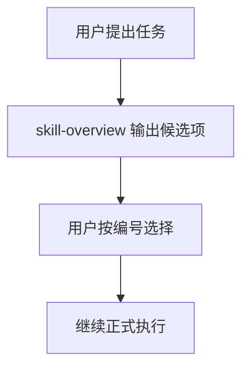

# Skill Overview Skill

一个用于 Codex 的前置选择类 skill。它会在正式开发、创作、分析、调试、安装或配置前，先把可能用到的插件、技能和 subagent 用中文整理出来，让用户按编号选择后再继续执行。

## 解决什么问题

当安装的 skills、plugins、subagents 变多后，模型有时会自动匹配到不是你想要的能力；而很多技能说明又是英文，不方便快速判断。

`skill-overview` 的目标是：

- 先分析用户任务目标
- 列出可能相关的插件、技能、subagent
- 用中文解释每个候选项能做什么
- 按区域分组，避免列表混乱
- 使用统一编号，方便用户回复编号选择
- 用户确认前，暂停真正的开发或创作

## 工作流程

1. 用户提出任务
2. `skill-overview` 先输出候选清单
3. 用户按编号选择
4. 再进入真正的开发、创作或执行



## 选择面板示例

```md
任务目标：为一个 React 项目做 UI 优化

--- 插件 ---
| 编号 | 名称 | 推荐度 | 中文说明 | 建议 |
|---:|---|---|---|---|
| 1 | build-web-apps | 高 | 适合构建和调试前端页面 | 建议启用 |

--- 技能 ---
| 编号 | 名称 | 推荐度 | 中文说明 | 建议 |
|---:|---|---|---|---|
| 2 | skill-overview | 高 | 先整理候选能力并等待选择 | 已启用 |
| 3 | design-taste-frontend | 中 | 适合提升页面审美和视觉质感 | 可选 |

--- Subagent ---
| 编号 | 名称 | 推荐度 | 中文说明 | 建议 |
|---:|---|---|---|---|
| 4 | frontend-developer | 中 | 适合复杂前端实现或并行分工 | 可选 |

推荐组合：1 + 3
请回复编号，例如：选 1、3；或回复 不使用，直接继续。
```

## 功能特点

- 中文优先：把候选能力的用途翻译成更容易理解的中文。
- 分区展示：插件、技能、subagent 分开列出。
- 统一编号：所有候选项连续编号，方便直接回复编号。
- 先选后做：用户确认前，不开始真正执行任务。
- 主动调用也会补全：即使用户已经指定某个插件或 skill，也会继续补充可能遗漏的相关项。
- 安全提醒：遇到删除、付款、授权、发送消息、部署等高风险操作时要求二次确认。

## 安装方式

把 `skill-overview` 文件夹复制到你的 Codex skills 目录：

```powershell
Copy-Item -Recurse .\skill-overview "$env:USERPROFILE\.codex\skills\skill-overview"
```

然后重启 Codex。

## 推荐搭配 AGENTS.md

单靠 skill 不能保证每次对话都第一个触发。想更稳定，建议在你的 `AGENTS.md` 或全局指令中加入类似规则：

```md
每次用户提出开发、创作、分析、调试、安装、配置等任务后，正式执行前，先调用 `skill-overview` skill。
该 skill 输出候选插件、技能和 subagent 清单，并等待用户确认。
用户确认前，不要进入开发、创作或执行阶段。
```

## 使用方式

可以主动输入：

```text
$skill-overview 帮我分析这个任务应该用哪些技能
```

或者在支持隐式调用的环境中，让它作为开发前的能力选择门。

## 注意事项

- 它不能真正修改 Codex 内部的 skill 匹配优先级。
- 它不能保证 100% 每次都自动第一个触发。
- 它更像一个前置决策辅助器，适合配合 `AGENTS.md` 使用。

## 目录结构

```text
skill-overview/
├── SKILL.md
└── agents/
    └── openai.yaml
```

## 许可

请按你的仓库许可协议使用；如未声明，建议补充 LICENSE 文件。
