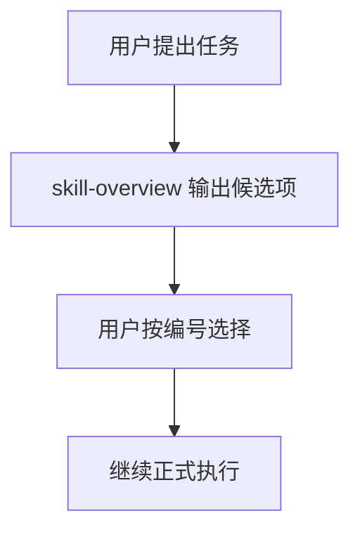

# Skill Overview Skill

> 先选能力，再做任务。

一个用于 Codex 的前置选择类 skill。它会在正式开发、创作、分析、调试、安装或配置前，先把可能用到的插件、技能和 subagent 用中文整理出来，让用户按编号选择后再继续执行。

## 一眼看懂

- **用途**：先把可用能力列出来，再决定用哪些
- **对象**：插件 / 技能 / subagent
- **方式**：中文分区 + 统一编号
- **结果**：用户确认前，不直接开始执行

## 适合谁用

- 安装了很多 skill / plugin / subagent，怕模型自动选错
- 想在真正开工前先看清可选方案
- 习惯用中文快速判断工具用途
- 想把复杂任务拆成更清楚的选择步骤

## 工作流程



## 输出示例

```md
任务目标：为一个 React 项目做 UI 优化

--- 插件 ---
| 编号 | 名称 | 推荐度 | 中文说明 | 建议 |
|---:|---|---|---|---|
| 1 | build-web-apps | 高 | 适合构建和调试前端页面 | 建议启用 |

--- 技能 ---
| 编号 | 名称 | 推荐度 | 中文说明 | 建议 |
|---:|---|---|---|---|
| 2 | skill-overview | 高 | 先整理候选能力并等待选择 | 已启用 |
| 3 | design-taste-frontend | 中 | 适合提升页面审美和视觉质感 | 可选 |

--- Subagent ---
| 编号 | 名称 | 推荐度 | 中文说明 | 建议 |
|---:|---|---|---|---|
| 4 | frontend-developer | 中 | 适合复杂前端实现或并行分工 | 可选 |

推荐组合：1 + 3
请回复编号，例如：选 1、3；或回复 不使用，直接继续。
```

## 能解决什么问题

- 自动匹配错 skill
- 英文说明看不懂
- 一次只唤起一部分相关能力
- 列表太乱，不好选
- 需要把主动点名的 skill/plugin 也一起补全候选

## 常见回复

- `选 1、3`
- `只用 2`
- `不使用，直接继续`
- `先别做，换一组候选`

## 说明

单靠 skill 不能保证每次都第一个触发。想更稳，建议配合 `AGENTS.md` 写前置规则。

## 安装

把 `skill-overview` 文件夹复制到你的 Codex skills 目录，然后重启 Codex。

## 目录结构

```text
skill-overview/
├── SKILL.md
└── agents/
    └── openai.yaml
```
