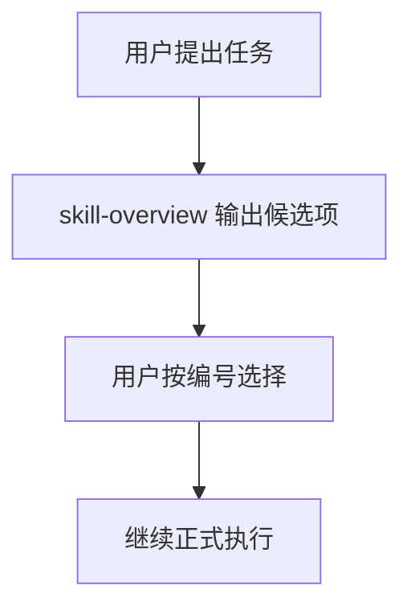

# Skill Overview Skill

<p align="center">
  
  
  
</p>

<p align="center">
  <b>先选能力，再做任务。</b><br>
  为 Codex 提供一个前置选择门：先把可能用到的插件、技能和 subagent 用中文列出来，再让用户按编号决定。
</p>

---

## 这个 skill 做什么

当可用能力越来越多时，模型可能会自动选错、选少，或者只给出英文说明。
`skill-overview` 的作用就是在正式执行前先把候选项整理出来，方便你快速决定用哪些。

### 它会做的事

- 先分析用户任务目标
- 列出可能相关的 **插件 / 技能 / subagent**
- 用中文解释用途、推荐度和边界
- 按区域分组，避免列表乱
- 使用统一编号，方便你直接回复编号
- 用户确认前，不进入真正执行

---

## 推荐使用场景

- 新项目开始前先选工具
- 多技能环境下做任务分流
- 用户已经点名一个 skill，但还想补齐相关能力
- 复杂任务需要先判断是否要并行 subagent
- 想把英文技能说明翻成中文给人看

---

## 典型流程



---

## 输出长什么样

```md
任务目标：为一个 React 项目做 UI 优化

--- 插件 ---
| 编号 | 名称 | 推荐度 | 中文说明 | 建议 |
|---:|---|---|---|---|
| 1 | build-web-apps | 高 | 适合构建和调试前端页面 | 建议启用 |

--- 技能 ---
| 编号 | 名称 | 推荐度 | 中文说明 | 建议 |
|---:|---|---|---|---|
| 2 | skill-overview | 高 | 先整理候选能力并等待选择 | 已启用 |
| 3 | design-taste-frontend | 中 | 适合提升页面审美和视觉质感 | 可选 |

--- Subagent ---
| 编号 | 名称 | 推荐度 | 中文说明 | 建议 |
|---:|---|---|---|---|
| 4 | frontend-developer | 中 | 适合复杂前端实现或并行分工 | 可选 |

推荐组合：1 + 3
请回复编号，例如：选 1、3；或回复 不使用，直接继续。
```

---

## 用户怎么回复

- `选 1、3`
- `只用 2`
- `不使用，直接继续`
- `先别做，换一组候选`

---

## 适合谁用

- 安装了很多 skill / plugin / subagent，怕模型自动选错
- 想在真正开工前先看清可选方案
- 习惯用中文快速判断工具用途
- 想把复杂任务拆成更清楚的选择步骤

---

## 常见问题

### 它能保证每次都第一个被调用吗？

不能。它只能提高命中率，想更稳还是要配合 `AGENTS.md`。

### 它能改 Codex 的内部优先级吗？

不能。它只是一个选择辅助 skill，不是系统级规则。

### 为什么要统一编号？

为了让用户直接回 `选 1、3、5`，比逐个说名字更快。

### 为什么要分插件、技能、subagent 三块？

为了让人一眼分清不同类型的能力，避免列表太乱。

---

## 安装

把 `skill-overview` 文件夹复制到你的 Codex skills 目录，然后重启 Codex。

---

## 目录结构

```text
skill-overview/
├── SKILL.md
└── agents/
    └── openai.yaml
```
